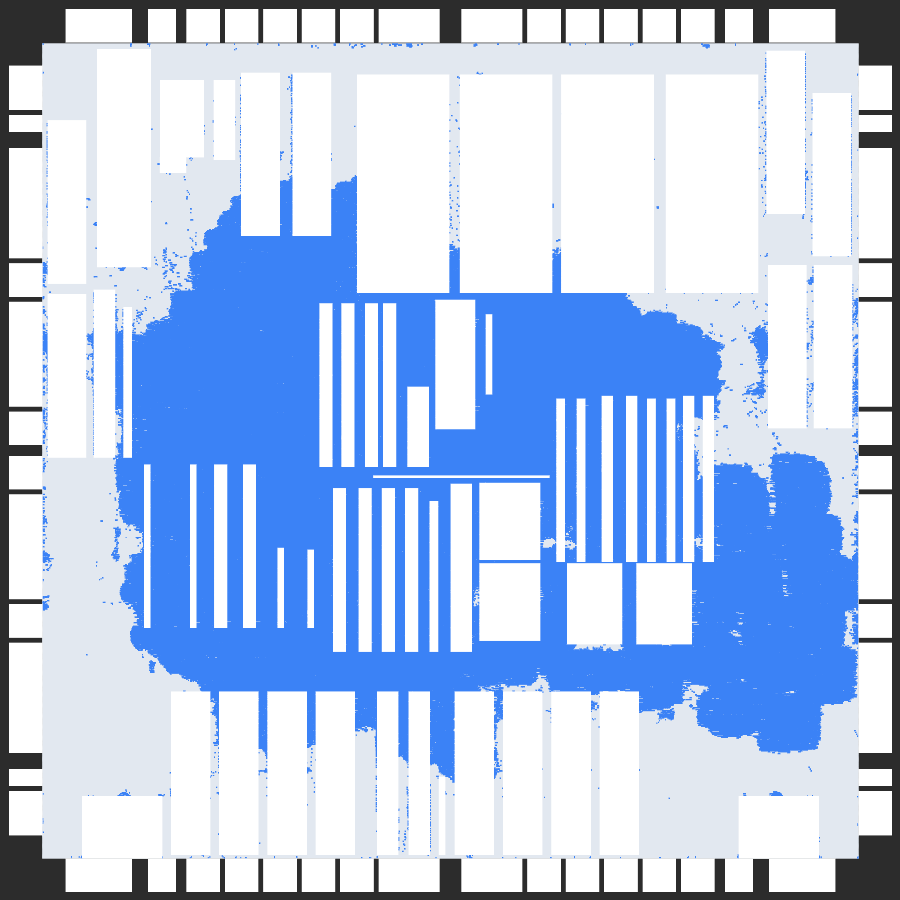
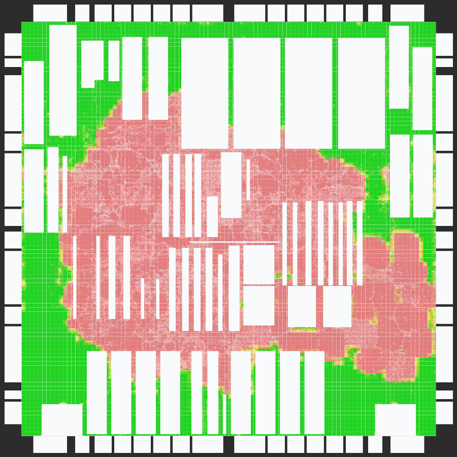
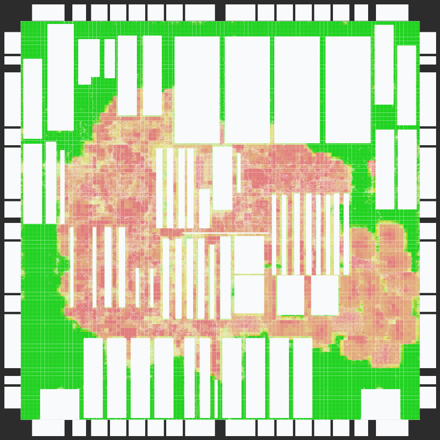
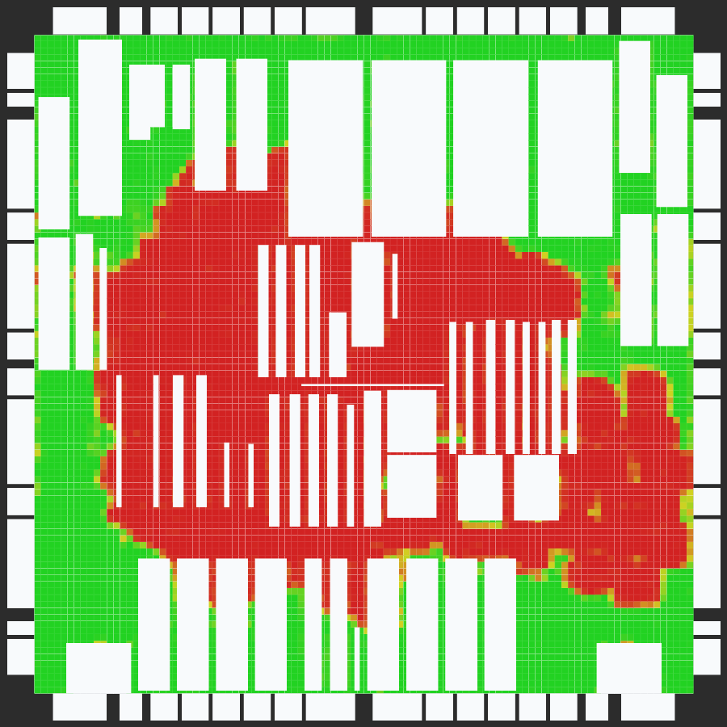

# Placement parser and renderer

A dependency-free C++23 pipeline for physical-design placement data. It parses
Bookshelf row-based designs into a compact binary model, then renders that model
as a placement view or a density heatmap.

| Placement | Utilization |
| :---: | :---: |
|  |  |
| **Pin density** | **Cell density** |
|  |  |

_The same adaptec1 placement rendered four ways._

The parser, serializer, and renderer communicate only through the
format-neutral `placement::Board` model. New input formats, persistent formats,
and renderers can therefore be added independently.

## Build

The only build requirement is a C++23 compiler. The default Makefile uses
`clang++`.

```sh
make
make test
```

This creates:

- `build/bin/placement_parse` — Bookshelf to binary
- `build/bin/placement_render` — binary to SVG

## Use

Parse a Bookshelf AUX manifest:

```sh
build/bin/placement_parse design.dp.aux design.placebin
```

Render the placement:

```sh
build/bin/placement_render design.placebin placement.svg
```

Render any of the available analysis views:

```sh
build/bin/placement_render --output-format utilization-svg \
  design.placebin utilization.svg
build/bin/placement_render --output-format pin-density-svg \
  design.placebin pin-density.svg
build/bin/placement_render --output-format cell-density-svg \
  design.placebin cell-density.svg
```

Use `--bin-size SIZE` to set the heatmap bin width, `--dark-mode` to select the
alternate palette, or `--placement-file placement.pl` during parsing to replace
the placement named by the AUX manifest. Run either executable with `--help`
for its complete syntax.

## Supported data

The Bookshelf backend reads `.aux`, `.nodes`, `.nets`, optional `.wts`, `.scl`,
and `.pl` files. It preserves cells, macros, fixed objects, rows and subrows,
nets, pins, weights, placements, orientations, and pin offsets. Parser errors
include the source component and line number.

SVG output supports:

- `svg`: rows, movable cells, macros, and fixed objects
- `utilization-svg`: movable area relative to available legal row area
- `pin-density-svg`: oriented pin locations, saturated at the 95th percentile
- `cell-density-svg`: exact movable-object overlap per available bin area

Heatmaps use green, yellow, and red for increasing density. Macro footprints
remain visible, and detailed bin values are embedded as SVG tooltips. Every
view uses the full design bounds, while heatmap bins remain confined to the
legal placement region.

## Binary format

All integers are fixed-width little-endian values and all real values are
IEEE-754 binary64. A `PLACEBIN` file contains, in order:

1. The eight-byte `PLACEBIN` magic.
2. A length-prefixed design name and 64-bit cell, row, net, and pin counts.
3. Cell records: name, dimensions, kind, macro flag, optional placement, and
   weights.
4. Row records: geometry, orientation, symmetry, and subrows.
5. Net records: name, flattened pin range, and weights.
6. Pin records: cell index, direction, and two offsets.

Strings and weight vectors have 32-bit lengths. Readers validate counts,
references, enum values, truncation, and trailing data; writers replace outputs
atomically.

## Benchmarks

Download the ISPD 2005 and movable-macro benchmark sets, then generate every
binary and SVG view:

```sh
./scripts/prepare_data.sh
make -j 8 outputs
```

Results are written under `out/`. If matching DREAMPlace `.gp.pl` files are
available, `make outputs` also renders those placements. To generate them while
preparing the data, supply an explicit DREAMPlace launcher and configuration
directory; see `./scripts/prepare_data.sh --help`.

Useful maintenance targets are `make valgrind`, `make clean`, and
`make clean-outputs`.

## Project layout

```text
include/placement/   Public model and extension interfaces
src/parsing/         Bookshelf parser
src/serialization/   Binary serializer
src/rendering/       SVG renderers
src/apps/            Thin command-line applications
test/                Unit tests and synthetic fixtures
```
